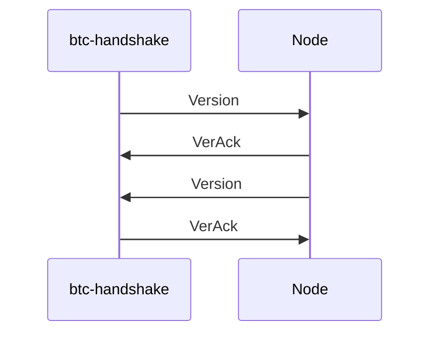

## [Architectural Decision Record](https://github.com/joelparkerhenderson/architecture-decision-record)

This document describes the architecture decisions for the `p2p-handshake` project.

# Requirements

1. **Platform Compatibility**
   - [x] The current implementation has been thoroughly tested on both Linux and MacOS, ensuring that the CLI application can be built and run using Cargo or installed on the system.

2. **Full Protocol-Level Handshake**
   - [x] The solution fulfills the requirement of performing a complete protocol-level handshake with the target node. This includes implementing both Bitcoin and Ethereum initial handshake protocols and disconnecting from each node after the handshake to prevent lingering connections.

3. **Instructions and Verifiability**
   - [x] The provided instructions include information on how users can verify that the handshake has successfully concluded. Users have the ability to access a high-level summary of the handshake results for each node. Additionally, detailed step-by-step information can be viewed by running the command with the `RUST_LOG=debug` or `RUST_LOG=trace` environment variable.

4. **Independence from Target Node Code**
   - [x] The solution for Ethereum handshake leverages the best components from the [reth](https://github.com/paradigmxyz/reth) library. These components offer valuable structures and functions for Ethereum handshake, allowing us to avoid duplicating existing work, especially for the ECIES part of the handshake. In the case of the Bitcoin handshake, we have implemented it from scratch, using only the [rust-bitcoin](https://github.com/rust-bitcoin/rust-bitcoin/tree/master) library for network message types, serialization, and deserialization.

5. **No Complete Reuse of Preexisting Handshake Implementations**
   - [x] The Ethereum handshake in the solution uses select components from the [reth](https://github.com/paradigmxyz/reth) library. This approach avoids the complete adoption of preexisting handshake implementations. Additionally, the Bitcoin handshake implementation is created from the ground up, with a focus on utilizing the [rust-bitcoin](https://github.com/rust-bitcoin/rust-bitcoin/tree/master) library for necessary network message handling, serialization, and deserialization.

### Non-requirements

1. **Mandatory Parameters**
   - [x] The current implementation includes only mandatory parameters in the handshake process, ensuring that the solution remains focused and efficient.

2. **Post-Handshake Traffic and Connection Lifespan**
   - [x] The current implementation disconnects from each node after the handshake to prevent any post-handshake traffic or the need to maintain an ongoing connection.


### ETH Handshake in Detail

The Ethereum handshake is a sequence of messages exchanged between two nodes when they connect to each other.

The initial handshake is described in the [Initial Handshake section](https://github.com/ethereum/devp2p/blob/master/rlpx.md#initial-handshake) of [The RLPx Transport Protocol](https://github.com/ethereum/devp2p/blob/master/rlpx.md#the-rlpx-transport-protocol).

#### Implementation Details

The current implementation of the Ethereum initial handshake for the initiator is divided into two distinct steps:

1. **ECIES Connection Establishment:**
   - The ECIES connection establishment is implemented using a state machine to handle the decoding of incoming data and encoding of outgoing data via a codec. This allows the handshake to transition between different states during the interaction between peers.
   - The first stage of the ECIES handshake involves each side of the connection sending an authentication message. This message contains essential components such as the ephemeral public key, the signature of the public key, a nonce, and other metadata.
   - It then waits for and parses the returned ECIES ingress authentication acknowledgment (auth ack) message from the recipient. This represents the second stage of the ECIES handshake, where each side sends an acknowledgment (ack) message containing the nonce and additional metadata.

2. **Hello Message Exchange:**
   - The Ethereum handshake proceeds with a hello message exchange.
   - A hello message is created, including the necessary fields for the handshake, and it is sent to the peer.
   - Upon receiving a hello message from the recipient, the implementation attempts to decode and verify its contents.
   - Following the hello message exchange, a disconnect message is sent to the recipient, and the connection is closed to prevent it from being kept alive.

These steps and components together constitute the Ethereum handshake, providing a secure and efficient connection between nodes.

#### Notes

- The initial handshake intentionally omits certain validation steps such as version validation, shared capabilities validation, ping/pong message exchange, and other non-mandatory parameters. The current implementation strictly adheres to the inclusion of only essential parameters and steps for the handshake to keep it lightweight and efficient.

- For those interested in viewing all the detailed steps involved in the handshake process, you can run the command with the `RUST_LOG=trace` environment variable. This will provide comprehensive logs that outline each step of the handshake, offering a more in-depth view of the process.

### BTC Handshake in Detail

The Bitcoin handshake is a sequence of messages exchanged between two nodes when they connect to each other. To initiate the [initial handshake](https://github.com/bitcoinbook/bitcoinbook/blob/develop/ch08.asciidoc#network_handshake) with a Bitcoin node, the following messages need to be sent:



#### Implementation Details

To perform the initial handshake with a Bitcoin node, we leverage the [rust-bitcoin](https://github.com/rust-bitcoin/rust-bitcoin/tree/master) library. This library provides us with the necessary network message types, serialization, and deserialization capabilities required for the Bitcoin handshake.

Responsibilities are split between handling the exchange of messages over the TCP stream and the message encoding/decoding process. We make use of the `tokio_util` library to facilitate message encoding and decoding, while the `tokio::net::TcpStream` is employed to manage the exchange of messages over the TCP stream. This approach allows for an efficient and streamlined execution of the Bitcoin handshake process.

### Project Structure

The primary design principle for this project is to maintain a clear separation between the library-level code and the main application-level code. This separation allows for the efficient addition of new blockchain P2P handshake implementations in the future.

The project is structured as follows:

```plaintext
.
├── src
│   ├── lib.rs        ## Libraries that can be reused.
│   ├── main.rs       ## Application for running the CLI.
│   ├── telemetry.rs  ## Telemetry module.
│   ├── p2p           ## The P2P module and its submodules.
│   │   ├── commands.rs   ## CLI commands.
│   │   ├── config.rs     ## CLI configuration.
│   │   ├── error.rs      ## Library errors.
│   │   ├── btc.rs        ## Implementation of the Bitcoin handshake.
│   │   └── btc           ## Bitcoin handshake module.
│   │       ├── codec.rs  ## Message encoding and decoding.
│   │       └── stream.rs ## TCP stream handling.
│   │   ├── eth.rs        ## Implementation of the Ethereum handshake.
│   │   └── eth           ## Ethereum handshake module.
│   │       ├── constants.rs ## Constants for the Ethereum handshake.
│   │       ├── stream.rs    ## Ethereum handshake message handling.
│   │       └── utils.rs     ## Utility functions for Ethereum handshake.
│   └── p2p.rs        ## P2P module handshake implementation.
├── tests
│   ├── test_btc_handshake.rs ## Integration test reaching predefined Bitcoin nodes.
│   └── test_eth_handshake.rs ## Integration test reaching Holesky Ethereum nodes.
```

### A CLI Tool

The initial implementation of this project serves as a Command-Line Interface (CLI) tool. It utilizes the [clap](https://docs.rs/clap/latest/clap/) crate, a widely used and well-maintained Rust library for building CLI tools.

Additionally, it leverages the [tracing](https://docs.rs/tracing/latest/tracing/) library to facilitate comprehensive logging of all handshake steps, ensuring transparency and enabling detailed information delivery to the user.

### IO Bound Rust Program

Given that our program is primarily IO bound, we have chosen to use the Tokio library runtime to efficiently handle asynchronous IO operations. This approach enables us to process each handshake concurrently without incurring the overhead of creating native threads for processing each network message. As a result, we can achieve excellent performance when dealing with multiple nodes simultaneously.

- [ ] Future enhancements could involve reading the node list from a file or parsing it from an external source and processing each node in a concurrent manner.

#### Notes

1. While most of the program operates asynchronously, there is a section that involves encoding and decoding from the synchronous buffer in the Bitcoin codec handshake, which can be CPU-intensive. To address this, we can consider using `tokio::task::spawn_blocking` to spawn a new thread for each blockchain node, avoiding the blocking of the Tokio runtime thread pool and efficiently handling CPU-intensive tasks. However, this approach introduces additional overhead for creating native threads for processing each node and may impact performance.
- [ ] Alternatively, we can explore implementing stream processing via the AsyncRead/AsyncWrite traits, which would allow us to leverage the Tokio runtime thread pool for CPU-intensive tasks. This approach may require additional implementation time and could be considered for future improvement, particularly if the [rust-bitcoin](https://github.com/rust-bitcoin/rust-bitcoin) library introduces a separate trait similar to [futures_io::AsyncBufRead](https://docs.rs/futures-io/latest/futures_io/trait.AsyncBufRead.html) as discussed in [this rust-bitcoin issue](https://github.com/rust-bitcoin/rust-bitcoin/issues/1251).

2. Adhering to the principle from the Go programming language that suggests, `"Do not communicate by sharing memory; instead, share memory by communicating,"` we could explore implementing the Actor model for each blockchain node processing. This would allow us to process each handshake concurrently and avoid the overhead of creating native threads for processing each network message. However, this approach would increase the complexity of our solution and require more time for implementation.


### Program Output

To gain insight into the program's execution, we utilize the native [tracing](https://docs.rs/tracing/latest/tracing/) crate for logging. Tracing offers a highly flexible and extensible logging system, allowing configuration for various log formats and destinations.

For simplicity, we opt to use the [tracing-subscriber](https://docs.rs/tracing-subscriber/latest/tracing_subscriber/) crate, which provides a default configuration for logging to the standard output. Users have the flexibility to set the log level to `debug` or `trace` using the `RUST_LOG` environment variable to access more detailed information about the handshake process.

In addition, we incorporate the [measure_time](https://docs.rs/measure_time/latest/measure_time/) crate to measure the time taken for each handshake. This functionality can prove invaluable for future optimizations and serves as an informative resource for our users.

### Open-Closed Principle

The current implementation of the `p2p-handshake` project adheres to the Open-Closed Principle, which dictates that the software should be open for extension but closed for modification. This design principle allows us to seamlessly integrate new blockchain P2P handshake protocols in an efficient manner.

The process for adding support for a new blockchain's P2P handshake involves the following steps:

1. **Add a New CLI Subcommand:** Introduce a new CLI subcommand to accommodate the specific requirements of the new blockchain.

2. **Extend the P2P Library:** Create a new module for the new blockchain within the [P2P library](src/p2p).

3. **Implement the Handshake Protocol:** Develop the handshake implementation for the new blockchain, following the pattern set by existing protocols like [Ethereum (eth)](src/p2p/eth.rs).

This approach ensures that we can effortlessly expand our application's capabilities to support various blockchain P2P handshake protocols without the need for extensive modifications to the existing codebase.

### Error Handling

In the `p2p-handshake` project, we prioritize effective error handling to ensure that issues are identified, reported, and managed gracefully. We employ two primary libraries for error handling:

1. **Library-Level Error Handling:**

   At the library level, we utilize the [thiserror](https://docs.rs/thiserror/latest/thiserror/index.html) crate to create custom error types. Specifically, we define the [P2PError](src/p2p/error.rs) type, which includes custom error messages to address errors arising during the handshake process. Custom error types help us maintain clarity and transparency within the library, allowing us to convey precise error information.

2. **Application-Level Error Handling:**

   At the application level, we rely on the [eyre](https://docs.rs/eyre/latest/eyre/) crate to handle errors gracefully. This approach ensures that any errors occurring during the execution of the CLI application are managed effectively. Eyre enables us to provide informative and user-friendly error messages without exposing the intricate details of internal errors. This user-centric error handling approach enhances the overall usability of the application.

By combining these two error handling mechanisms, we strike a balance between library-level control and application-level user-friendliness, resulting in robust and user-oriented error handling throughout the `p2p-handshake` project.

### Testing

Testing is a fundamental aspect of ensuring the reliability and correctness of the `p2p-handshake` project. We employ the [tokio-test](https://docs.rs/tokio-test/latest/tokio_test/index.html) crate to facilitate the testing of asynchronous code in an efficient and organized manner.

#### Unit Tests

The `p2p-handshake` project includes unit tests to verify the functionality of the Ethereum and Bitcoin handshake implementations. These tests focus on specific components and behaviors, ensuring that each part of the handshake process performs as expected. Some key unit tests include:

- `btc::test_handshake_passthrough`: This test validates that the Bitcoin handshake successfully passes through all the required steps.

- `eth::test_handshake_passthrough`: Similar to the Bitcoin test, this unit test checks that the Ethereum handshake correctly progresses through its steps.

- `eth::test_handshake_timeout_err`: This test evaluates the handshake process under timeout conditions, confirming that it produces the expected timeout error.

- `eth::test_handshake_disconnect`: In this test, the handshake is examined to verify that it correctly triggers a disconnect error when necessary.

Unit tests are vital for identifying and addressing issues in specific components of the handshake process. They also provide essential coverage for various scenarios and error conditions.

#### Integration Tests

In addition to unit tests, the `p2p-handshake` project features integration tests that examine the handshake process when interacting with real-world nodes. Specifically, for the Ethereum blockchain, we conduct integration tests with testnet Holesky Ethereum nodes while for Bitcoin we use the hardcoded ones. These tests mimic actual interactions and validate the handshake against real network conditions. Integration tests offer a comprehensive assessment of the project's functionality and its ability to communicate with external nodes.

The combination of unit and integration tests contributes to the overall robustness and reliability of the `p2p-handshake` project, ensuring that it performs as expected under various conditions and scenarios.

### References
[rust-bitcoin](https://github.com/rust-bitcoin/rust-bitcoin/tree/master)
[rust-bitcoin Push-based consensus decoding issue](https://github.com/rust-bitcoin/rust-bitcoin/issues/1251)
[The RLPx Transport Protocol](https://github.com/ethereum/devp2p/blob/master/rlpx.md#the-rlpx-transport-protocol)
